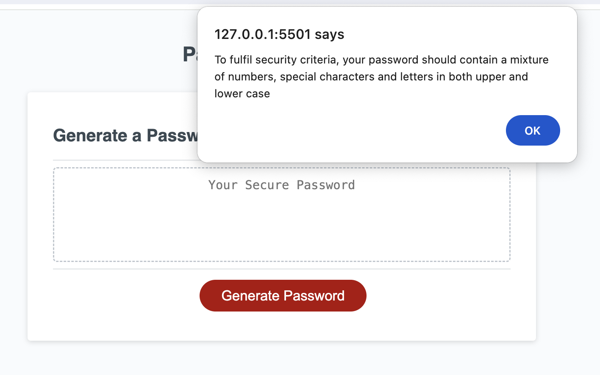
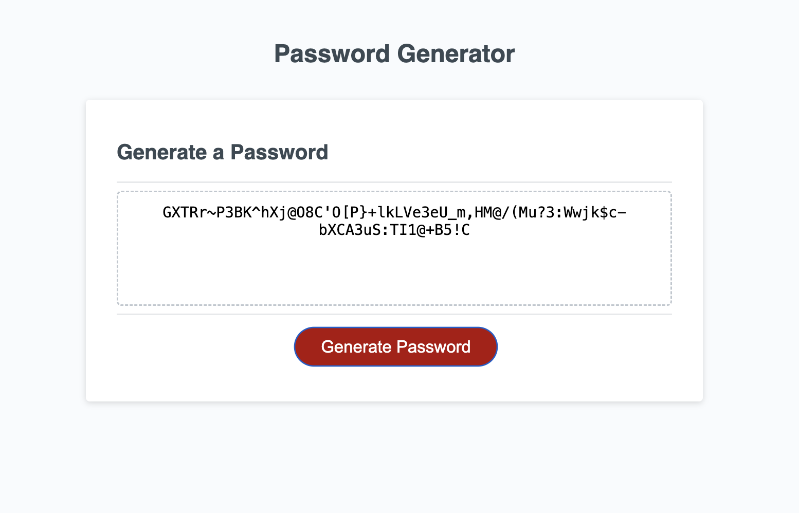

# Mod-5-Password-Generator
Week 5 coding challenge to create javascript for generating a password to fit security criteria

# Module 5 challenge: create a password-generating app that runs in the browser and uses a set of prompts to gather character requirements

This repository was created for the fifth challenge of the EdX Front End Web Development bootcamp to practise conditional logic, functions and message/pop-up boxes. A user interface was provided in terms of basic CSS and JS, to give a button and field in which to generate a password from code written as part of the challenge.

## Description

Challenge guidelines asked that users were given a series of prompts to ask which character sets they wished to include in their password. Starting with the conditional logic needed to build a set of characters according to the answers to the prompts, I added in an if loop to each of the two functions (getPasswordOptions and generatePassword) to exit the function if given criteria were not me regarding the length of password and amount of characters available to generate it. It is always prudent to include if loops to account for users not following guidelines for input, no matter how clearly it is stated! 

## Installation

N/A

## Usage

https://github.com/SpecialFriendRice/Mod-5-Password-Generator

https://specialfriendrice.github.io/Mod-5-Password-Generator/

## Credits

Referred to own notes from course and Xpert Learning Assistant for syntax queries. Tutorial with TA Erik Hoversten clarified in what order functions and if loops needed to be located in order to return to user to start most efficiently when criteria not met.

## License

MIT Licence, as outlined in the Github repository.